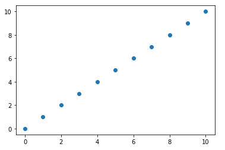
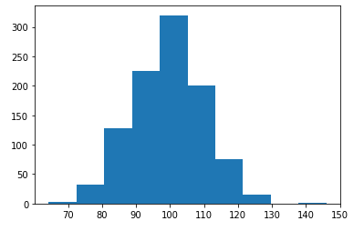
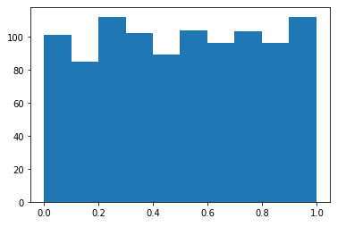
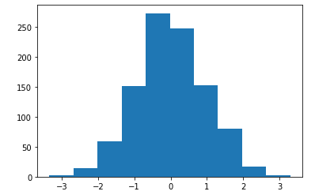
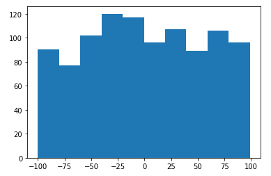

# 05_Numpy

- Numeric Python
- Vector, Matrix 연산에 상당한 편의성 제공
- Numpy는 그자체로 의미가 있다기 보다는 다른 module의 기본 자료구조로 이용
- pandas의 matplotlib의 기본 자료구조로 이용
- numpy의 자료구조
  - 다차원 배열을 이용(n-dimensional array) => ndarray
  - ndarray는 python의 list와 유사
  - ndarray는 같은 데이터 타입을 사용
  - list보다는 메모리 사용이나 속도면에서 이점

## 1. 설치

```bash
$ conda install numpy	# Anaconda

$ pip install numpy		# Python
```

## 2. 생성

- numpy module import

  ```python
  import numpy as np
  ```

### 2.1 List 생성

#### 2.1.1 일반적인 생성

```python
# list를 만들어 보자
my_list = [1, 2, 3, 4]
print(my_list)					# [1, 2, 3, 4]
print(type(my_list))			# <class 'list'>
print(my_list[0])				# 1
print(type(my_list[0]))			# <class 'int'>

# numpy array를 만들어 보자
my_arr = np.array([1, 2, 3, 4])
print(my_arr)					# [1 2 3 4]
print(type(my_arr))				# <class 'numpy.ndarray'>
print(my_arr[0])				# 1
print(type(my_arr[0]))			# <class 'numpy.int32'>
print(my_arr.dtype)				# int32

# 두번째 numpy array를 만들어 보자
my_arr = np.array([100, 3.14, "Hello", True])
print(my_arr)					# ['100' '3.14' 'Hello' 'True']
print(my_arr.dtype)				# <U32 유니코드
```

#### 2.1.2 타입 명시 생성

```python
my_list = [[1, 2, 3], [4, 5, 6]]
arr = np.array(my_list, dtype = np.float64) # 실수형

print(my_list)					# [[1, 2, 3], [4, 5, 6]]
print(arr)						# [[1. 2. 3.]
								#  [4. 5. 6.]]
print(my_list[1][1])			# 5
print(arr[1,1])					# 5.0
```

### 2.2 활용

#### 2.2.1 numpy 함수

```python
import numpy as np

my_list = [1, 2, 3, 4]
arr = np.array(my_list) # 1차원의 numpy array가 생성
print(arr.ndim)         # ndim : 차원 출력 함수  1
print(arr.shape)        # numpy array의 형태를 tuple로 표현  (4,)
print(arr.size)         # numpy array안의 요소 개수  4

my_list = [[1, 2], [3, 4], [5, 6]]
arr = np.array(my_list) # 2차원의 numpy array가 생성
print(arr)
print(arr.ndim)         # 2
print(arr.shape)        # (3, 2)
print(arr.size)         # 6
```

#### 2.2.2 numpy 함수 이해

```python
import numpy as np

my_list = [[1, 2, 3], [4, 5, 6], [7, 8, 9], [10, 11, 12]]
```

- Array화

  ```python
  arr = np.array(my_list)
  print(arr)
  ```

  ```python
  [[ 1  2  3]
   [ 4  5  6]
   [ 7  8  9]
   [10 11 12]]
  ```

- shape 형태 바꾸기

  ```python
  arr.shape = (12,)		# 1차원
  print(arr)
  ```

  ```python
  [ 1  2  3  4  5  6  7  8  9 10 11 12]
  ```

  ```python
  arr.shape = (2, 2, 3)	# 3차원
  print(arr)
  ```

  ```python
  [[[ 1  2  3]
    [ 4  5  6]]
  
   [[ 7  8  9]
    [10 11 12]]]
  ```

- 타입 확인

  ```python
  import numpy as np
  
  arr = np.array([1.2, 3.4, 5.6, 7.8, 9.1])
  print(arr.dtype)		# float64
  
  my_arr = arr.astype(np.int32) # numpy array dtype을 변환할 때 사용
  print(my_arr)			# [1 3 5 7 9]
  ```

- 다양한 행렬 생성

  ```python
  import numpy as np
  
  arr = np.array([1, 2, 3, 4, 5]) # 일반적인 생성 방법
  print(arr)
  
  arr = np.zeros((3,4))			# shape을 알려줘야 함 영행렬
  print(arr)
  
  arr = np.ones((3,4))			# 모든 항이 1인 행렬	
  print(arr)
  
  arr = np.empty((3,4))			# 쓰레기값으로 형태만 갖춘 행렬
  print(arr)
  
  arr = np.full((3,4), 9, dtype = np.float64) # 3x4 행렬 생성 type이 float64인 실수 9로 채워넣음
  print(arr)
  ```

- arrange로 특정 조건으로 행렬 만들기

  ```python
  import numpy as np
  
  # arange의 인자로 (0, 10, 2)를 사용했는데
  # 0은 포함 10은 포함X 간격 2 range와 같다
  arr = np.arange(0, 10, 2)
  print(arr)  	# [0 2 4 6 8]
  
  arr = np.arange(10)
  print(arr)
  
  arr = np.arange(1.3, 7.2)
  print(arr)		# [1.3 2.3 3.3 4.3 5.3 6.3]
  ```

- reshape

  ```python
    arr = np.arange(0, 12, 1)
    arr_1 = arr.reshape(4,3) # 복사본을 얻고자 할시 arr.reshape(4,3).copy()
    # 새로운 numpy array View가 생성 형태만 변경
    print(arr)				# [ 0 1 2 3 4 5 6 7 8 9 10]
    print(arr_1)			# 4x3 행렬
    arr[0] = 100   # 원본 변경시 reshape한 view도 변경, 메모리 관리 유용
    
    print(arr)				# [100 1 2 3 4 5 6 7 8 9 10 11]
    print(arr_1)			# 4x3 행렬
  ```

- resize

  ```python
  arr = np.arange(0, 12, 1)
  arr1 = np.resize(arr, (2, 6)) # reshape와 는 다르게 복사본을 생성
  print(arr)
  print(arr1)
  arr[0] = 100
  print(arr)
  print(arr1)
  ```

#### 2.2.3 집계 함수

```python
# 행렬의 곱

arr_1 = np.array([[1, 2], [3, 4], [5, 6]])
arr_2 = np.array([[1, 2, 3], [4, 5, 6]])

print(np.matmul(arr_1, arr_2))
```

```python
print(arr.sum())	# print(np.sum(arr)) 행렬 인자들의 합계
print(arr.mean())	# 평균
print(arr.max()) 	# 최대값
print(arr.min()) 	# 최소값
print(arr.std()) 	# 표준편차
```

```python
## 이런 함수를 사용할 때 축(axis)이라는 개념을 이용해서 사용
## 위의 함수를 사용할 때 axis를 명시하지 않으면 axis = None으로 설정 => numpy array 전체에 대해 함수 적용
arr1 = np.array([1, 2, 3, 4, 5])
## 1차원의 numpy array가 생성, axis = 0 => 열방향
print(arr1.sum(axis = 0))  # 15

arr = np.array([[1, 2, 3], [4, 5, 6], [7, 8, 9], [10, 11, 12]])
print(arr)
print(arr.sum())
print(arr.sum(axis = 0))   # [22 26 30]  행방향 합계
print(arr.sum(axis = 1))   # [6 15 24 33]  열방향 합계
```

#### 2.2.4 실습

```python
## MovieLens 데이터 파일을 이용
## Group Lens에서 수집한 영화에 대한 평점 데이터
## 영화에 대한 선호도를 1~5점 까지로 표현
## 데이터파일을 다운로드
## MovieLens Data 파일 분석
import numpy as np

# 1. 데이터 로딩(CSV 파일로부터 데이터 읽기)
data = np.loadtxt("data/movielens/ratings.csv", delimiter = ",", dtype = np.int32)

# 2. 상위 5개의 행만 출력해보자
print(data[:5,:])
```

```pytho
# 모든 영화에 대한 전체 평균 평점은?

print(data.mean(axis = 0)[2])

mean_rate = data[:,2].mean()
print(mean_rate)
print(data.shape)
```

```python
# 각 사용자별 평균 평점을 구하자

users = list(set(data[:,0]))

u_mean = []
for i in range(len(users)):
   
    u_sum = 0
    count = 0
    for j in range(len(data)):
       
        if str(users[i]) == str(data[j,0]):
           
            count = count + 1 
            u_sum += data[j,2]
            
    u_mean.append(round(u_sum/count,3))
for i in range(len(users)):
    print("사용자 id : {0}, 사용자의 평균 평점 : {1}".format(users[i],u_mean[i]))
```

## 2.3 그래프

- 선형

  ```python
  import numpy as np
  import matplotlib.pyplot as plt
  
  # start부터 end까지 범위에서 주어진 num개의 간격으로 데이터를 생성하고 싶을때
  arr = np.linspace(0, 10, 11)
  print(arr)
  
  plt.plot(arr, "o")  # plot : 선형 그래프	"o" 제거시 선형 그래프 출력
  plt.show()
  ```

  

- 정규분포 히스토그램

  ```python
  import numpy as np
  import matplotlib.pyplot as plt
  
  # numpy array를 만드는데 난수를 이용해서
  # numpy array를 만드려면 어떻게 해야 하나요?
  # 1. np.random.normal()
  # 정규분포를 이용한 난수를 발생시키고 이를 이용해서 numpy배열을 생성
  # np.random.normal(평균, 표준편차, shape)
  my_mean = 100
  my_std = 10
  arr = np.random.normal(my_mean,my_std,(1000,)) # 난수 1000개 
  plt.hist(arr, bins=10) # bins : 구간 수
  plt.show()
  ```

  

- 균등분포 히스토그램

  ```python
  import numpy as np
  import matplotlib.pyplot as plt
  
  # np.random.rand() : 균등분포로 난수를 생성할때 사용
  # [0,1)   [ : 이상, ) : 미만
  arr = np.random.rand(1000)
  plt.hist(arr, bins=10)
  plt.show()
  ```

  

- 표준 정규분포 히스토그램

  ```python
  import numpy as np
  import matplotlib.pyplot as plt
  
  # np.random.randn() : 표준정규분포에서 난수를 추출하여 numpy array를 만들때 사용
  # 표준정규분포 : 평균 0, 표준편차가 1인 정규분포
  # [0,1)   [ : 이상, ) : 미만
  arr = np.random.randn(1000)
  plt.hist(arr, bins=10)
  plt.show()
  ```

  

- 지정 범위 균등분포 히스토그램

  ```python
  import numpy as np
  import matplotlib.pyplot as plt
  
  # np.random.randint() : 균등분포로 주어진 범위에서 정수형 난수를 발생
  arr = np.random.randint(-100, 100, (1000,))  # -100 ~ 100 사이의 1000개 난수
  plt.hist(arr, bins=10)
  plt.show()
  ```

  

