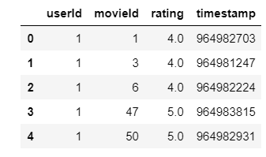
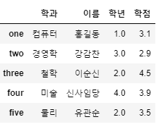

# 06_01_Pandas

## 0. Pandas?

- Pandas는 Python Data Analysis의 핵심 Module(Package)

- Data Analysis

  1. 탐색적 데이터 분석(EDA, Exploratory Data Analysis)
     - Excel을 이용한 Data Analysis
     - Python 언어로 Pandas를 이용해서 EDA 수행
  2. 통계적 데이터 분석(SDA, Statistical Data Analysis)
     - 통계적 이론을 이용한 분석
  3. 머신 러닝(ML, Machine Learning)
     - 기존 데이터를 이용해서 프로그램을 학습, 학습된 결과를 이용해 예측

- Pandas는 고유한 자료구조를 2개 사용

  | 자료구조  |                            설 명                             |
  | :-------: | :----------------------------------------------------------: |
  |  Series   | Numpy의 1차원 배열과 유사<br>동일한 데이터 타입의 복수개의 요소로 구성 |
  | DataFrame | Table 형식으로 구성된 자료구조<br>2차원 배열과 유사, DB 테이블과 유사 |

## 1. 시작하기

- Anaconda에서 설치

  ```bash
  $ anaconda install pandas
  ```

- Python에서 설치

  ```bash
  $ pip install pandas
  ```

## 2. Series

### 2.1 Numpy Array vs Pandas Series

```python
import numpy as np
import pandas as pd

arr = np.array([-1, 10, 50 ,99], dtype = np.float64)
print(arr)	# [-1 10 50 99]
print(arr.dtype)

s = pd.Series([-1, 10, 50, 99], dtype = np.float64)
display(s)	
print(s.values)	# numpy 1차원 array로 리턴 [-1. 10. 50. 99.]
print(s.index)	# RangeIndex(start=0, stop=4, step=1)
print(s.dtype)	# float64
```

```
[-1. 10. 50. 99.]
float64

0    -1.0
1    10.0
2    50.0
3    99.0
dtype: float64

[-1. 10. 50. 99.]
RangeIndex(start=0, stop=4, step=1)
float64
```

### 2.2 Index 

```python
s = pd.Series([-1, 10, 50, 99], index=['c','a','k','tt'])
display(s)
print(s['a'])		# 다른 형식의 인덱스 사용 가능
print(s[1])			# 원래 형태의 숫자 인덱스 또한 사용 가능
print(s[1:3])		# 일반적인 slicing 사용 가능
print(s['c':'k'])	# slicing 사용 가능 하지만 일반적인 방법과는 다르게 뒤의 인덱스의 값도 포함
print(s.sum())		# 인자들의 전체 합 158
```

```
c     -1
a     10
k     50
tt    99
dtype: int64

10
10
a    10
k    50
dtype: int64

c    -1
a    10
k    50
dtype: int64
158
```

### 2.3 연산

```python
## A 공장의  2019-01-01 부터 10일간 제품 생산량을 Series에 저장
## 단, 생산량의 평균은 50이고 표준편차는 5인 정규분포에서 생산량을 랜덤하게 결정
## B공장의 평균은 70이고 표준편차는 8
from datetime import date, timedelta
from dateutil.parser import parse

start_day = parse("2020-01-01")
factory_a = pd.Series([int(x) for x in np.random.normal(50, 5, (10,))],
                     index=[start_day + timedelta(days=x) for x in range(10)])
# display(factory_a)

factory_b = pd.Series([int(x) for x in np.random.normal(70, 8, (10,))],
                     index=[start_day + timedelta(days=x) for x in range(10)])
# display(factory_b)

display(factory_a + factory_b)
```

```
2020-01-01    125
2020-01-02    119
2020-01-03    120
2020-01-04    125
2020-01-05    127
2020-01-06    120
2020-01-07    126
2020-01-08    127
2020-01-09    110
2020-01-10    107
dtype: int64
```

### 2.4 Dictionary를 이용한 Series

```python
my_dict = {"서울": 3000, "부산" : 2000, "제주" : 8000}
s = pd.Series(my_dict)
display(s)
```

```
서울    3000
부산    2000
제주    8000
dtype: int64
```

```python
s.name = "지역별 가격 데이터"
s.index.name = "지역"
display(s)
```

```
지역
서울    3000
부산    2000
제주    8000
Name: 지역별 가격 데이터, dtype: int64
```

## 3. DataFrame

### 3.1 Dictionary를 이용한 DataFrame

```python
data = {"name" : ["kim", "lee", "park", "moon", "kim"],
        "year" : [2015, 2016, 2019, 2019, 2015],
        "point" : [3.1, 4.3, 1.2, 2.3, 3.9]}
df = pd.DataFrame(data)
display(df)
```


```python
print("DataFrame의 shape : {}".format(df.shape))
print("DataFrame의 요소개수 : {}".format(df.size))
print("DataFrame의 차원 : {}".format(df.ndim))
print("DataFrame의 index : {}".format(df.index))
print("DataFrame의 컬럼 : {}".format(df.columns))
print("DataFrame의 데이터 : {}".format(df.values))
```

```
DataFrame의 shape : (5, 3)
DataFrame의 요소개수 : 15
DataFrame의 차원 : 2
DataFrame의 index : RangeIndex(start=0, stop=5, step=1)
DataFrame의 컬럼 : Index(['name', 'year', 'point'], dtype='object')
DataFrame의 데이터 : [['kim' 2015 3.1]
 ['lee' 2016 4.3]
 ['park' 2019 1.2]
 ['moon' 2019 2.3]
 ['kim' 2015 3.9]]
```

### 3.2 파일을 이용한 DataFrame

- 테스트를 위한 csv 파일 [다운로드](https://grouplens.org/datasets/movielens/)

```python
df = pd.read_csv("./data/movielens/rating.csv")
```

#### 3.2.1 CSV파일을 JSON파일로 바꾸기

```python
df = pd.read_csv("./data/movielens/ratings.csv")

## DataFrame에 들어있는 데이터를 JSON 형태로 저장하기
new_df = df.head()
display(new_df)

new_df.to_json("./data/movielens/ratings.json")
```



#### 3.2.2 JSON파일을 읽어서 DataFrame 만들기

```python
import json

file = open("./data/movielens/ratings.json", "r")
my_dict = json.load(file)
file.close()
df = pd.DataFrame(my_dict)
display(df)
```


#### 3.2.3 MySQL을 읽어서 DataFrame 만들기

##### 3.2.3.0 사전 준비

- Anaconda에서 설치

  ```bash
  $ conda install pymysql
  ```

- Python에서 설치

  ```bash
  $ pip install pymysql
  ```

##### 3.2.3.1 MySQL 환경 설정

- 테스트 계정 생성

  ```mysql
  CREATE USER python IDENTIFIED BY "python";
  
  CREATE USER python@localhost IDENTIFIED BY "python";
  ```

- DataBase 생성

  ```mysql
  CREATE DATABASE library;
  ```

- 권한 부여

  ```mysql
  GRANT ALL PRIVILEGES ON library.* TO python;
  
  GRANT ALL PRIVILEGES ON library.* TO python@localhost;
  ```

##### 3.2.3.2 DB 연결

```python
import pymysql.cursors
import numpy as np
import pandas as pd

conn = pymysql.connect(host="localhost", user="python", password="python", db="library", charset="utf8")

sql = "SELECT * FROM 테이블명"
df = pd.read_sql(sql, con=conn)
display(df)
```

### 3.3 DataFrame의 제어

```python
import numpy as np
import pandas as pd

data = {
        "이름" : ["홍길동", "강감찬", "이순신", "신사임당"],
        "학과" : ["컴퓨터", "경영학", "철학", "미술"],
        "학년" : [1, 3, 2, 4],
        "학점" : [3.1, 2.9, 4.5, 3.9]
       }
df = pd.DataFrame(data, columns=["학과", "이름", "학년", "학점"], index=["one", "two", "three", "four"])
display(df)
```


#### 3.3.1 describe() : 기본 통계

```python
display(df.descrbe())
```


#### 3.3.2 특정 컬럼을 추출

```python
year = df["학년"] # year => Series => View로 가져옴 => 원본 데이터에 영향 O
# year = df["학년"].copy() # View가 아닌 복사본을 이용 => 원본 데이터 영향 X
year[0] = 100
diplay(year)
display(df)
```


```python
display(df[["학과", "이름"]])
```


#### 3.3.3 컬럼 값 수정하기

- 스칼라로 수정하기

  ```python
  df["학년"] = 4
  ```

  

- List와 Numpy Array로 수정하기

  ```python
  # df["학년"] = [1, 1, 2, 2]   # List
  df["학년"] = np.array([1, 1, 3, 2]) # numpy array
  ```

  

#### 3.3.4 새로운 컬럼 추가하기

- 일반적인 방법

  ```python
  df["나이"] = [20, 21, 22, np.nan]	# 값을 모를 때는 np.nan을 이용
  ```

  

- Pandas를 이용한 방법

  ```python
  df["나이"] = pd.Series([20, 21, 23, 24], index=["one", "two", "three", "four"]) 
  ```

  

  

  ```python
  df["나이"] = pd.Series([20, 21, 23], index=["one", "two", "four"]) 
  ```

  

- 조건을 받아서 컬럼을 추가하기

  ```python
  df["장학금여부"] = df["학점"] > 3.0
  ```

  

#### 3.3.5 컬럼 삭제하기

```python
new_df = df.drop("학점", axis=1, inplace=False)	# inplace=True이면 원본 삭제
display(new_df)
display(df)
```


#### 3.3.6 Row Indexing

- 일반적인 index 번호로는 Row을 선택이 불가능하다.`df[0], df["one"]`

- 그래서 Slicing을 해서 보아야 한다.

  ```python
  display(df["one" : "three"])
  ```

  

- 1개의 행을 선택하면 Series로 리턴

  ```python
  display(df.loc["one"])
  ```

  ```
  학과        컴퓨터
  이름        홍길동
  학년          1
  학점        3.1
  장학금여부    True
  Name: one, dtype: object
  ```

- Index를 이용

  ```python
  display(df.loc["one":"three"])
  ```

  

- Fancy Indexing

  ```python
  display(df.loc[["one", "three"]])
  ```

  

  ```python
  display(df.loc["one":"three", "이름":"학점"])
  ```

  

  ```python
  display(df.loc["one":"three", ["이름","학년"]])
  ```

  

#### 3.3.7 Row 추가하기

- 넣으려는 Row의 컬럼과 기존의 DataFrame의 컬럼이 같아야 한다.

  ```python
  df.loc["five",:] = ["물리", "유관순", 2, 3.5]
  ```

  