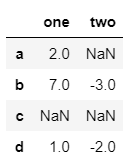
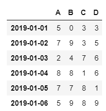
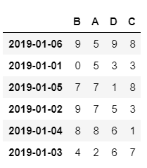
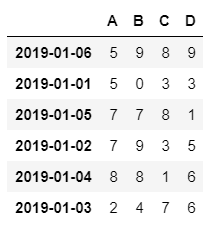
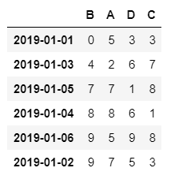
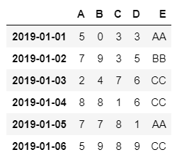
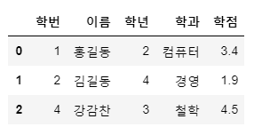
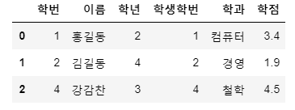
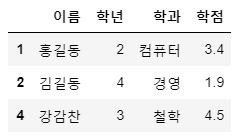

# 06_02_Pandas

## 1. 합계와 평균에서의 NaN

```python
import numpy as np
import pandas as pd

data = [[2, np.nan],
        [7, -3],
        [np.nan, np.nan],
        [1, -2]]
df = pd.DataFrame(data,
                  columns = ["one", "two"],
                  index = ["a", "b", "c", "d"])
display(df)
```



- 열 방향 합계 구하기

  ```python
  display(df.sum(axis=0))
  ```

  ```bash
  one    10.0
  two    -5.0
  dtype: float64
  ```

- 행 방향 합계 구하기

  ```python
  display(df.sum(axis=1))
  ```

  ```bash
  a    2.0
  b    4.0
  c    0.0	# NaN은 0으로 간주되니 주의
  d   -1.0
  dtype: float64
  ```

- 특정 열의 합계 구하기

  ```python
  display(df["one"].sum())
  ```

  ```
  10.0
  ```

- 특정 행의 합계 구하기

  ```python
  display(df.loc["b"].sum())
  ```

  ```
  4.0
  ```

- 평균 구하기

  - **평균을 구할때는 합계와는 달리 NaN을 배제**

  ```python
  display(df["one"].mean())
  ```

  ```
  3.3333333333333335
  ```

## 2. 결측값 처리

- 평균으로 대체하기

  ```python
  df["one"].fillna(value=df["one"].mean(), inplace = False)
  ```

  ```python
  a    2.000000
  b    7.000000
  c    3.333333	# 결측값이 평균값으로 대체 됨
  d    1.000000
  Name: one, dtype: float64
  ```

- 최소값으로 대체하기

  ```python
  df["two"].fillna(value=df["two"].min(), inplace = False)
  ```

  ```python
  a   -3.0	# 결측값이 최소값으로 대체 됨
  b   -3.0
  c   -3.0	# 결측값이 최소값으로 대체 됨
  d   -2.0
  Name: two, dtype: float64
  ```

## 3. 정렬하기

```python
# random값을 도출해서 DataFrame을 생성
np.random.seed(0)

## 0~9까지의 정수형 난수를 생성(6, 4) 형태로 생성
df = pd.DataFrame(np.random.randint(0,10,(6,4)))
df.columns = ["A", "B", "C", "D"]
df.index = pd.date_range("20190101", periods = 6)

display(df)
```



- 뒤섞기

  ```python
  # 순열 랜덤 치환
  random_date = np.random.permutation(df.index) 
  
  # 원본은 고정되어 있고 바뀐 결과 DataFrame 리턴
  df2 = df.reindex(index = random_date, columns=["B", "A", "D", "C"])
  
  display(df2)
  ```

  

- Column 기반 Index 정렬

  ```python
  df2.sort_index(axis=1, ascending = True)	# False는 내림차순
  ```

  

- Value 기반 정렬

  ```python
  df2.sort_values(by = ["B", "A"])	# 기본적으로 오름차순
  df2.sort_values(by = ["B", "A"], ascending = False)	# 내림차순
  ```

  

## 4. 기타 데이터 다루기

- 새로운 Column을 추가

  ```python
  df["E"] = ["AA", "BB", "CC", "CC", "AA", "CC"]
  ```

  

- 배열로 중복을 제외한 값 출력

  ```python
  df["E"].unique()
  ```

  ```python
  # ndarray 타입
  array(['AA', 'BB', 'CC'], dtype=object)
  ```

- 각 Value 값들의 개수를 세는 함수

  ```python
  df["E"].value_counts()
  ```

  ```python
  # Series 타입
  CC    3
  AA    2
  BB    1
  Name: E, dtype: int64
  ```

- Boolean Mask를 만들기 위한 함수

  ```python
  df["E"].inin(["AA"])
  ```

  ```python
  # Series 타입
  2019-01-01     True
  2019-01-02    False
  2019-01-03    False
  2019-01-04    False
  2019-01-05     True
  2019-01-06    False
  Freq: D, Name: E, dtype: bool
  ```

## 5. DataFrame Merge

```python
import numpy as np
import pandas as pd

data1 = {"학번" : [1, 2, 3, 4],
         "이름" : ["홍길동", "김길동", "이순신", "강감찬"],
         "학년" : [2 ,4, 1, 3]}
data2 = {"학번" : [1, 2, 4, 5],
         "학과" : ["컴퓨터", "경영", "철학", "기계"],
         "학점" : [3.4, 1.9, 4.5, 2.7]}
df1 = pd.DataFrame(data1)
df2 = pd.DataFrame(data2)
```

- 키의 이름이 같을 경우

  ```python
  # pd.merge(테이블1, 테이블2, on=기준, how= "inner" or "outer"("left", "right"))
  ```

  ```python
  pd.merge(df1, df2, on = "학번", how ="inner") 
  ```

  


- 키의 이름이 다를 경우

  ```python
  # merge한 DataFrame의 Column명은 뒤의 DataFrame의 Column명
  pd.merge(df1, df2, left_on = "학번", right_on = "학생학번", how="inner")
  ```

  

- 인덱스를 기준으로 merge할 경우

  ```python
  data1 = {"이름" : ["홍길동", "김길동", "이순신", "강감찬"],
           "학년" : [2 ,4, 1, 3]}
  data2 = {"학과" : ["컴퓨터", "경영", "철학", "기계"],
           "학점" : [3.4, 1.9, 4.5, 2.7]}
  df1 = pd.DataFrame(data1, index=[1, 2, 3, 4])
  df2 = pd.DataFrame(data2, index=[1, 2, 4, 5])
  ```

  ```python
  pd.merge(df1, df2, left_index = True, right_index = True, how = "inner")
  ```

  

## 6. 연습

- 실습 데이터 [다운로드](https://drive.google.com/open?id=1Njx4Yu6VsITN_Vb67g9g1nUs7FpBURqN)

- Data Loading

  ```python
  import numpy as np
  import pandas as pd
  
  df = pd.read_csv("./data/LoanData/LoanStats3d.csv", sep = ",", skiprows = 1)
  ```

- 데이터 수 확인

  ```python
  display(df.shape)
  ```

- 필요한 Column만 추출해서 새로운 DataFrame 생성

  ```python
  # loan_amnt : 대출 금액
  # loan_status : 대출 상태
  # grade : 대출 등급
  # int_rate : 이자율
  # term : 대출기간
  df2 = df[["loan_amnt", "loan_status", "grade", "int_rate", "term"]]
  ```

- 새로운 DataFrame 확인

  ```python
  df2.head()
  ```

- 각 Column의 값 확인

  ```python
  display(df2["loan_status"].unique())
  display(df2["grade"].unique())
  display(df2["term"].unique())
  ```

- 결측값 제거

  ```python
  display(df2.shape)
  df2.dropna(how = "any", inplace = True)
  ```

- 대출 기간별 대출 총액 구하기

  ```python
  print("대출기간 36 개월 대출 총액 : {:,}".format(df2.loc[df2["term"] == " 36 months", "loan_amnt"].sum()))
  print("대출기간 60 개월 대출 총액 : {:,}".format(df2.loc[df2["term"] == " 60 months", "loan_amnt"].sum()))
  
  terms = df2["term"].unique()
  term_result = {}
  
  for t in terms:
      term_sum = df2.loc[df2["term"] == t, "loan_amnt"].sum()
      term_result[t] = term_sum
      
  for key in term_result:
      print("{}".format(key), end = " : ")
      print("{}".format("{:,}".format(term_result[key])))
  ```

- ```python
  ## 대출 중 불량한 상태의 대출에 대해서
  ## 불량한 상태의 대출( Charged Off, Late (31-120 days), Late (16-30 days), In Grace Period )
  ## 각 Grade의 대출 건수를 구하라
  
  bad_loan_status = df2["loan_status"].unique()[[1, 3, 4, 5]]
  
  # 불량 대출에 대한 mask 생성
  bad_mask = df2["loan_status"].isin(bad_loan_status)
  print(bad_mask.sum())
  
  df3 = df2.loc[bad_mask, "grade"]
  df3.value_counts().sort_index() 
  ```

