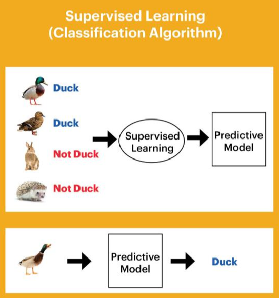
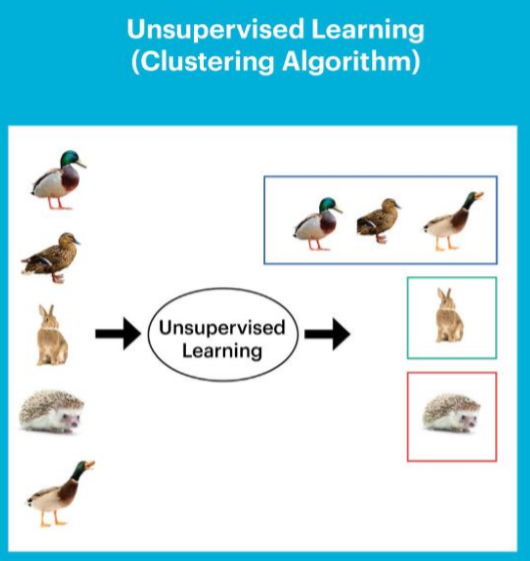

# 07_01_TensorFlow

## 1. TensorFlow ?

- Google이 만든 Machine Learning Library
- Open Source Library
- 수학적 계산을 하기 위한 Library
- Data Flow Graph를 이용
- TensorFlow는 Node와 Edge로 구성된 방향성 있는 Graph
  - Node : 데이터의 입출력과 수학적 계산
  - Edge : Tensor를 Node로 실어 나르는 역할
  - Tensor : 동적 크기의 다차원 배열을 지칭

### 1.1 TensorFlow 설치

#### 1.1.1 CPU 버전

- Python에서 설치

  ```bash
  $ pip install tensorflow==2.0
  ```

- Anaconda에서 설치

  ```bash
  $ conda install tesnsorflow==2.0
  ```

#### 1.1.2 GPU 버전

1. [https://developer.nvidia.com/cuda-toolkit-archive](https://developer.nvidia.com/cuda-toolkit-archive)에서 CUDA 10.0 다운로드 및 설치

2. [https://developer.nvidia.com/rdp/cudnn-download](https://developer.nvidia.com/rdp/cudnn-download)에서 for CUDA 10.0 다운로드 및 압축 해제

   - 압축 해제된 CUDA에서 lib, include, bin 폴더 등의 파일을 전체 복사
   - 1.에서 설치된 경로에 붙여넣기

3. 환경 변수 확인

   - 잘 되어있지 않다면 아까 추가한 lib, include, bin 폴더의 경로 추가

4. tensorflow-gpu 설치

   - Python에서

     ```bash
     $ pip install tensorflow-gpu==2.0
     
     # 업그레이드 시
     $ pip install --upgrade tensorflow-gpu==2.0
     ```

   - Anaconda에서

     ```bash
     $ conda install tensorflow-gpu==2.0
     ```

## 2. TensorFlow 기초

### 2.1 출력

- Node는 숫자 연산과 데이터 입출력을 담당

  ```python
  my_node = tf.constant("Hello World")
  print(my_node.numpy().decode())   # 입력한 데이터 출력 .decode()
  ```

### 2.2 constant

- 선언과 동시에 초기화

  ```python
  node1 = tf.constant(10, dtype = tf.float32)
  node2 = tf.constant(20, dtype = tf.float32)
  
  node3 = node1 + node2
  
  print(node3.numpy())
  print([node1.numpy(), node2.numpy(), node3.numpy()])
  ```
  
  ```
  30.0
[10.0, 20.0, 30.0]
  ```

## 3. Machine Learning

- 프로그램 자체가 **데이터를 기반으로 학습**을 통해 배우는 능력을 가지는 프로그래밍

### 3.1 Learning의 종류

#### 3.1.1 Supervised Learning(지도 학습)

- Training Set이라고 불리는 Label화 된 데이터를 통해 학습



- Linear Regression(선형 회귀) - 공부 시간 : 시험 점수
- Logistic Regression(로지스틱 회귀)
  - Binary Classification(이항 분류) - 공부 시간 : 합격/불합격
  - Multinomial Classification(다향 분류) - 공부 시간 : 학점

#### 3.1.2 Unsupervised Learning(비지도 학습)

- Label화 되지 않은 데이터를 통해 학습
- 데이터를 이용해 스스로 학습



## 4. Linear Regression

- Linear Regression의 가장 큰 목표는 가설의 완성
  $$
  가설(Hypothesis) = Wx + b
  $$

### 4.1 Training Data Set 준비

```python
import tensorflow as tf
import numpy as np
import matplotlib.pyplot as plt
import random

x = [1, 2, 3]
y = [2, 4, 6]
```

### 4.2 Weight(W) & Bias(b) 준비

```python
W = tf.Variable(random.random(), name="weight")
b = tf.Variable(random.random(), name="bias")
```

- Hypothesis(가설)
  - 최종 목적은 Training Data에 가장 근접한 Hypothesis를 만드는 것(W와 b를 결정)
  - 잘 만들어진 가설은 W가 1에 b가 0에 가까워야 함

### 4.3 Cost(loss) Function

$$
cost(W, b) = \frac{1}{n} \sum\limits^{n}_{i=1}(H(x^i)-y^i)^2
$$

- cost 함수 선언

  ```python
  def compute_cost():
      H = W * x + b
      cost = tf.reduce_mean(tf.square(H - y))
      return cost
  ```

- **Cost Function Minimize**

  ```python
  optimizer = tf.optimizers.Adam(learning_rate = 0.01)
  ```

### 4.4 Training

```python
# 학습 진행
for step in range(3000):
    optimizer.minimize(compute_cost, var_list=[W, b])
    if step % 300 == 0:
        print("{}, {}, {}".format(W.numpy(), b.numpy(), compute_cost().numpy()))
```

### 4.5 Prediction

```python
feed_x = 8
predict_y = W * feed_x + b

print(predict_y.numpy())
```

### 4.5 그래프

- 그래프 범위

  ```python
  line_x = np.arrange(min(x), max(x), 0.01)
  line_y = W * line_x + b
  ```

- 그래프 그리기

  ```python
  plt.plot(line_x, line_y, 'r-')
  plt.plot(x, y, 'bo')
  plt.show()
  ```

  

### 4.5 소스

```python
x = [1, 2, 3]
y = [2, 4, 6]

W = tf.Variable(random.random(), name="weight")
b = tf.Variable(random.random(), name="bias")

def compute_cost():
    H = W * x + b
    cost = tf.reduce_mean(tf.square(H - y))
    return cost

optimizer = tf.optimizers.Adam(learning_rate = 0.01)

for step in range(3000):
    optimizer.minimize(compute_cost, var_list=[W, b])
    if step % 300 == 0:
        print("{}, {}, {}".format(W.numpy(), b.numpy(), compute_cost().numpy()))
        
line_x = np.arrange(min(x), max(x), 0.01)
line_y = W * line_x + b

plt.plot(line_x, line_y, 'r-')
plt.plot(x, y, 'bo')
plt.show()
```


