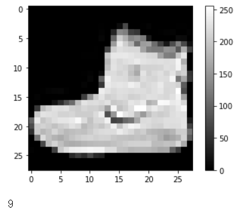
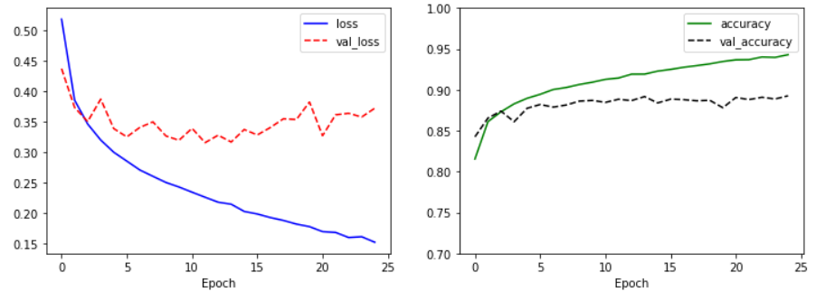

## 07_02_TensorFlow

## 1. 이항 분류

- 이향 분류란 범주의 수가 2개인 경우, 즉 0 or 1인 경우

### 1.1 데이터 준비

- 와인의 특성을 이용해 와인을 분류한 데이터 셋

  ```python
  import pandas as pd
  
  red = pd.read_csv('http://archive.ics.uci.edu/ml/machine-learning-databases/wine-quality/winequality-red.csv', sep=';')
  white = pd.read_csv('http://archive.ics.uci.edu/ml/machine-learning-databases/wine-quality/winequality-white.csv', sep=';')
  
  print(red.head())
  print(white.head())
  ```

- 각 항목 설명

  |        속 성         |           설 명            |
  | :------------------: | :------------------------: |
  |    fixed acidity     |   주석산(Tartaric acid)    |
  |   volatile acidity   |     초산(Acetic acid)      |
  |     citric acid      |           구연산           |
  |    residual sugar    |            당도            |
  |      chlorides       |        염화물(소금)        |
  | free sulfur dioxide  | 자유 이산화황(산화 방지제) |
  | total sulfur dioxide |        총 이산화황         |
  |       density        |            밀도            |
  |          pH          |            산도            |
  |      sulphates       |          황산칼륨          |
  |       alcohol        |         알콜 도수          |
  |       quality        |         품질(0~10)         |

### 1.2 합치기

```python
red['type'] = 0
white['type'] = 1

wine = pd.concat([red, white])
print(wine.describe())
```

- 합친 데이터들의 통계를 내보면 type의 평균이 0.75로 나오는데 white 와인의 개수가 더 많은 것을 확인 가능

### 1.3 데이터 확인

```python
print(wine.info())
```

```
 #   Column                Non-Null Count  Dtype  
---  ------                --------------  -----  
 0   fixed acidity         6497 non-null   float64
 1   volatile acidity      6497 non-null   float64
 2   citric acid           6497 non-null   float64
 3   residual sugar        6497 non-null   float64
 4   chlorides             6497 non-null   float64
 5   free sulfur dioxide   6497 non-null   float64
 6   total sulfur dioxide  6497 non-null   float64
 7   density               6497 non-null   float64
 8   pH                    6497 non-null   float64
 9   sulphates             6497 non-null   float64
 10  alcohol               6497 non-null   float64
 11  quality               6497 non-null   int64  
 12  type                  6497 non-null   int64  
```

- null 이 없으므로 진행

### 1.4 정규화

- 데이터의 특성이 차이가 심할 경우 오류 발생 가능하므로 정규화 진행

  ```python
  wine_norm = (wine - wine.min()) / (wine.max() - wine.min())
  ```

  - 각 속성의 최대값, 최소값을 얻어서 모든 속성에 각각 접근하여 계산

### 1.5 데이터 섞기

- 아직은 두 데이터프레임을 이어붙이기만 했기 때문에 학습시 치우침이 있을 수 있음

  ```python
  import numpy as np
  
  wine_shuffle = wine_norm.sample(frac=1)
  wine_np = wine_shuffle.to_numpy()
  ```

  - sample() 함수는 랜덤으로 뽑는 함수지만, frac을 1로 지정했기 때문에 섞일 수 있음

### 1.6 데이터 나누기

- 테스트 데이터와 훈련 데이터를 나눔

  ```python
  import tensorflow as tf
  
  train_idx = int(len(wine_np) * 0.8)
  
  train_X, train_Y = wine_np[:train_idx, :-1], wine_np[:train_idx, -1]
  test_X, test_Y = wine_np[train_idx:, :-1], wine_np[train_idx:, -1]
  
  train_Y = tf.keras.utils.to_categorical(train_Y, num_classes=2)
  test_Y = tf.keras.utils.to_categorial(test_Y, num_classes=2)
  ```

  - to_categorical은 행렬을 one-hot 인코딩으로 바꿈
    - 정답에 해당하는 인덱스는 1, 나머지는 0을 넣는 방식

### 1.7 학습 모델 생성 및 학습

- `keras.layers.Dense` : 신경망 구조를 간단하게 구현해주는 함수

```python
model = tf.keras.Sequential([
    tf.keras.layers.Dense(units=48, activation='relu', input_shape=(12,)),
    tf.keras.layers.Dense(units=24, activation='relu'),
    tf.keras.layers.Dense(units=12, activation='relu'),
    tf.keras.layers.Dense(units=2, activation='softmax')
])

model.compile(optimizer=tf.keras.optimizers.Adam(lr=0.07), loss='categorical_crossentropy', metrics=['accuracy'])

model.summary()
```

- softmax는 분류에서 가장 많이 쓰임

```python
history = model.fit(train_X, train_Y, epochs=25, batch_size=32, validation_split=0.25)
```

### 1.8 시각화

```python
import matplotlib.pyplot as plt
plt.figure(figsize=(12, 4))

plt.subplot(1, 2, 1)
plt.plot(history.history['loss'], 'b-', label='loss')
plt.plot(history.history['val_loss'], 'r--', label='val_loss')
plt.xlabel('Epoch')
plt.legend()

plt.subplot(1, 2, 2)
plt.plot(history.history['accuracy'], 'g-', label='accuracy')
plt.plot(history.history['val_accuracy'], 'k--', label='val_accuracy')
plt.xlabel('Epoch')
plt.ylim(0.7, 1)
plt.legend()

plt.show()
```

.assets/image-20200412211714215.png)

### 1.9 평가

```python
model.evaluate(test_X, test_Y)
```

```
[0.04214931259289957, 0.9907692]	// loss: 0.0226 - accuracy: 0.9908
```

## 2. 다항 분류

- 다항 분류란 이름에서 보듯이 범주의 수가 2개를 초과하는 경우

- 위의 와인 데이터 셋에서는 품질로 분류

### 2.1 데이터 정제

#### 2.1.1 확인

```python
print(wine['quality'].describe())
print(wine['quality'].value_counts())
```

```
count    6497.000000
mean        5.818378
std         0.873255
min         3.000000
25%         5.000000
50%         6.000000
75%         6.000000
max         9.000000
Name: quality, dtype: float64
6    2836
5    2138
7    1079
4     216
8     193
3      30
9       5
Name: quality, dtype: int64
```

#### 2.1.2 시각화

```python
import matplotlib.pyplot as plt
plt.hist(wine['quality'], bins=7, rwidth=0.8)
plt.show()
```

.assets/image-20200412212618942.png)

#### 2.1.3 데이터 분류

- 히스토그램을 살펴보면 범주의 수가 많은 데다 숫자의 차이가 심하기 때문에 임의로 3개의 범주로 나눔
- 범주는 3~5는 나쁨, 7~9는 좋음, 6은 보통으로 분류

```python
wine.loc[wine['quality'] <= 5, 'new_quality'] = 0
wine.loc[wine['quality'] == 6, 'new_quality'] = 1
wine.loc[wine['quality'] >= 7, 'new_quality'] = 2

print(wine['new_quality'].describe())
print(wine['new_quality'].value_counts())
```

- 다시 상기시키자면 loc는 특정한 데이터의 인덱스를 고를 수 있음

```
count    6497.000000
mean        0.829614
std         0.731124
min         0.000000
25%         0.000000
50%         1.000000
75%         1.000000
max         2.000000
Name: new_quality, dtype: float64
1.0    2836
0.0    2384
2.0    1277
Name: new_quality, dtype: int64
```

#### 2.1.4 데이터 정규화

```python
del wine['quality']
wine_norm = (wine - wine.min()) / (wine.max() - wine.min())
wine_shuffle = wine_norm.sample(frac=1)
wine_np = wine_shuffle.to_numpy()

train_idx = int(len(wine_np) * 0.8)
train_X, train_Y = wine_np[:train_idx, :-1], wine_np[:train_idx, -1]
test_X, test_Y = wine_np[train_idx:, :-1], wine_np[train_idx:, -1]
train_Y = tf.keras.utils.to_categorical(train_Y, num_classes=3)
test_Y = tf.keras.utils.to_categorical(test_Y, num_classes=3)
```

### 2.2 학습 모델 생성 및 학습

#### 2.2.1 데이터 확인

```python
print(wine.info())
```

```
Data columns (total 13 columns):
 #   Column                Non-Null Count  Dtype  
---  ------                --------------  -----  
 0   fixed acidity         6497 non-null   float64
 1   volatile acidity      6497 non-null   float64
 2   citric acid           6497 non-null   float64
 3   residual sugar        6497 non-null   float64
 4   chlorides             6497 non-null   float64
 5   free sulfur dioxide   6497 non-null   float64
 6   total sulfur dioxide  6497 non-null   float64
 7   density               6497 non-null   float64
 8   pH                    6497 non-null   float64
 9   sulphates             6497 non-null   float64
 10  alcohol               6497 non-null   float64
 11  type                  6497 non-null   int64  
 12  new_quality           6497 non-null   float64
dtypes: float64(12), int64(1)
```

#### 2.2.2 학습 모델 생성

```python
model = tf.keras.Sequential([
    tf.keras.layers.Dense(units=48, activation='relu', input_shape=(12,)),
    tf.keras.layers.Dense(units=24, activation='relu'),
    tf.keras.layers.Dense(units=12, activation='relu'),
    tf.keras.layers.Dense(units=3, activation='softmax')
])
```

#### 2.2.3 학습

```python
model.compile(optimizer=tf.keras.optimizers.Adam(lr=0.07), loss='categorical_crossentropy', metrics=['accuracy'])

history = model.fit(train_X, train_Y, epochs=25, batch_size=32, validation_split=0.25)
```

### 2.3 평가

#### 2.3.1 시각화

```python
import matplotlib.pyplot as plt
plt.figure(figsize=(12, 4))

plt.subplot(1, 2, 1)
plt.plot(history.history['loss'], 'b-', label='loss')
plt.plot(history.history['val_loss'], 'r--', label='val_loss')
plt.xlabel('Epoch')
plt.legend()

plt.subplot(1, 2, 2)
plt.plot(history.history['accuracy'], 'g-', label='accuracy')
plt.plot(history.history['val_accuracy'], 'k--', label='val_accuracy')
plt.xlabel('Epoch')
plt.ylim(0.7, 1)
plt.legend()	# 범례 입력

plt.show()
```

.assets/image-20200412220012273.png)

#### 2.3.2 모델 평가

```python
model.evaluate(test_X, test_Y)
```

```
[0.3827186397405771, 0.8130769]	// loss: 0.3697 - accuracy: 0.8131
```

## 3. Fashion MNIST

- Fashion MNIST는 손글씨가 아닌 옷과 신발, 가방의 이미지를 모아놓고 분류하는 문제로 28x28 픽셀은 같지만 MNIST보다 어려운 문제로 평가된다.

- 범주

  | 라벨 |    범주     |
  | :--: | :---------: |
  |  0   | 티셔츠/상의 |
  |  1   |    바지     |
  |  2   |   스웨터    |
  |  3   |   드레스    |
  |  4   |    코트     |
  |  5   |    샌들     |
  |  6   |    셔츠     |
  |  7   |   운동화    |
  |  8   |    가방     |
  |  9   |    부츠     |

### 3.1 데이터 준비

  - Fashion MNIST 데이터는 tf.keras에 기본 탑재되어 간단하게 불러올 수 있다.

    ```python
    import tensorflow as tf
    
    fashion_mnist = tf.keras.datasets.fashion_mnist
    (train_X, train_Y), (test_X, test_Y) = fashion_mnist.load_data()
    
    print(len(train_X), len(test_X))
    ```

    ```
    60000 10000
    ```

### 3.2 데이터 확인

  ```python
import matplotlib.pyplot as plt
  
plt.imshow(train_X[0], cmap='gray')
plt.colorbar()
plt.show()
  
print(train_Y[0])
  ```

  

  - train 데이터의 이미지 모양과 결과값이 9로 부츠를 나타내는 것을 확인할 수 있다.

### 3.3 데이터 정규화

- 데이터의 이미지가 0 ~ 255까지의 값을 가지므로 255로 나누면 0 ~ 1 사이의 값으로 정규화된다.

  ```python
  train_X = train_X / 255.0
  test_Y = test_Y / 255.0
  ```

### 3.4 모델 생성

```python
model = tf.keras.Sequential([
    tf.keras.layers.Flatten(input_shape=(28,28)),	# flatten은 평평하게 해줌
    tf.keras.layers.Dense(units=128, activation='relu'),
    tf.keras.layers.Dense(units=10, activation='softmax')
])

model.compile(optimizer=tf.keras.optimizers.Adam(),
             loss='sparse_categorical_crossentropy',
             metrics=['accuracy'])

model.summary()
```

- 1.6에서 tf.keras.utils.to_categorical 함수를 이용해 정답 행렬을 원-핫 인코딩으로 바꿨다.<br>그렇게 한다면 1x10의 행렬을 생성하게 되므로 이는 대부분의 값이 0인 행렬(희소 행렬)을 <br>사용하게 되는데 이는 시스템의 낭비로 이어질 수 있다.

### 3.5 학습

```python
history = model.fit(train_X, train_Y, epochs=25, validation_split=0.25)
```

### 3.6 시각화

```python
import matplotlib.pyplot as plt

plt.figure(figsize=(12, 4))

plt.subplot(1, 2, 1)
plt.plot(history.history['loss'], 'b-', label='loss')
plt.plot(history.history['val_loss'], 'r--', label='val_loss')
plt.xlabel('Epoch')
plt.legend()

plt.subplot(1, 2, 2)
plt.plot(history.history['accuracy'], 'g-', label='accuracy')
plt.plot(history.history['val_accuracy'], 'k--', label='val_accuracy')
plt.xlabel('Epoch')
plt.ylim(0.7, 1)
plt.legend()

plt.show()
```



- 검증 데이터의 손실이 감소하다가 시간이 지날수록 서서히 증가하는 과적합 현상을 확인할 수 있다.
- 이를 해결하기 위해서는 tf.keras.callbacks.EarlyStopping을 사용할 수 있다.

### 3.7 평가

```python
model.evaluate(test_X, test_Y)
```

```
==============================================================================================] - 1s 66us/sample - loss: 42.2120 - accuracy: 0.8702
[84.42399490814209, 0.8702]
```

- 87%의 평가 정확도를 확인할 수 있다.